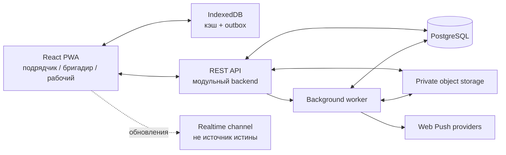

# Техническая архитектура

Версия: 1.0  
Статус: целевая архитектура MVP, ожидает технического ревью

## 1. Архитектурная цель

Нужно быстро запустить пилот, но не построить одноразовый прототип. Поэтому предлагается:

- один адаптивный React/PWA-клиент для всех ролей;
- один модульный backend;
- PostgreSQL как основная база;
- приватное объектное хранилище для файлов;
- локальная база и очередь операций для плохого интернета;
- API, которое позднее сможет использовать нативное приложение.

Первая версия не требует микросервисов. Модульный монолит проще разрабатывать, тестировать и сопровождать, при этом границы доменов закладываются сразу.

## 2. Общая схема

## 3. Клиентское приложение

### 3.1. Технологическая основа

Рекомендуемый стек:

- React + TypeScript;
- Vite;
- React Router;
- TanStack Query для серверного состояния;
- IndexedDB через Dexie для локальных данных и outbox;
- service worker для оболочки, ресурсов и push;
- WebAuthn API для passkey/системной биометрии;
- собственная дизайн-система на основе утверждённой стилистики.

Текущий визуальный прототип используется как референс. Он не считается готовой производственной кодовой базой без технического аудита.

### 3.2. Один продукт, разные оболочки

Не создаются три независимых приложения. Используется одна кодовая база:

- рабочему — мобильная PWA с минимальным числом действий;
- бригадиру — мобильная оперативная оболочка;
- подрядчику — адаптивный кабинет, одинаково пригодный для компьютера и телефона.

Роль влияет на навигацию, доступные действия и плотность данных, но не дублирует доменную логику.

### 3.3. Слои клиента

1. UI-компоненты и дизайн-токены.
2. Экранные сценарии ролей.
3. Доменные use cases.
4. Репозитории данных.
5. Онлайн API и локальное хранилище.
6. Sync engine и outbox.

UI не должен напрямую решать, отправить запрос на сервер или сохранить операцию локально. Эту работу выполняет репозиторий/sync-слой.

### 3.4. Локальное состояние

В IndexedDB хранятся только нужные пользователю данные:

- активные объекты;
- текущая смена;
- задачи ближайших дней;
- необходимые справочники;
- непрочитанная активность;
- черновики;
- outbox;
- временные метаданные файлов.

Полный архив организации на устройство не загружается.

## 4. Офлайн-синхронизация

### 4.1. Командная модель

Каждое изменение создаёт локальную команду:

- `operation_id`;
- `device_id`;
- тип;
- payload;
- ожидаемая версия сущности;
- время устройства;
- локальные зависимости.

Сервер применяет команду идемпотентно. Повторная отправка возвращает прежний результат, а не создаёт дубль.

### 4.2. Push/pull протокол

- клиент отправляет пакет накопленных операций;
- сервер возвращает результат каждой операции;
- клиент запрашивает изменения после последнего курсора;
- курсор продвигается только после локального сохранения;
- тяжёлые файлы загружаются отдельным возобновляемым потоком;
- текстовая операция не ждёт завершения фото, если это допустимо.

### 4.3. Конфликты

Автоматически объединяются независимые добавления: комментарии, фото, прогресс и события смены.

Явного решения требуют противоречивые замены:

- два человека изменили одно описание;
- ответственность одновременно взяли двое;
- результат проверен, пока автор отправлял другую версию;
- задача отменена во время офлайн-выполнения.

Правила подробно описаны в `OFFLINE_SYNC.md`.

### 4.4. Ограничение фоновой работы

Web Background Sync используется как дополнительная возможность, а не гарантия. Основные триггеры синхронизации:

- действие пользователя;
- появление сети;
- открытие приложения;
- возврат приложения на экран;
- периодическая попытка, пока приложение активно.

## 5. Backend

### 5.1. Стек

Рекомендуется Node.js + TypeScript, например NestJS или эквивалентная структурированная платформа. Выбор окончательно фиксируется техническим решением до начала реализации.

Внешний контракт — версионированный REST API с OpenAPI. WebSocket/SSE используется для ускорения обновления экранов, но после разрыва клиент всегда восстанавливает состояние через обычный sync API.

### 5.2. Модули

- Identity & Access;
- Organizations;
- Objects & Teams;
- Invitations;
- Tasks;
- Shifts & Timesheets;
- Issues;
- Communications;
- Files;
- Notifications;
- Reports;
- Sync;
- Audit;
- Administration.

Модули имеют явные публичные сервисы и не обращаются хаотично к таблицам друг друга.

### 5.3. Доменное событие

После успешной транзакции создаётся событие, например `task.result_submitted`. Из него формируются:

- уведомления;
- центр активности;
- аудит;
- пересчёт проекций;
- фоновые задания.

Это не полное event sourcing-приложение. История используется там, где она даёт проверяемость, но обычные текущие сущности остаются удобными для запросов.

## 6. База данных

### 6.1. PostgreSQL

PostgreSQL хранит транзакционные данные, версии, события, проекции и очередь небольших фоновых заданий на раннем этапе.

Обязательные меры:

- `organization_id` на бизнес-таблицах;
- составные индексы с организацией;
- внешние ключи;
- уникальные ограничения для идемпотентности;
- транзакции при принятии ответственности и закрытии периода;
- row-level security как дополнительный защитный слой там, где он оправдан;
- резервные копии и проверка восстановления.

RLS не заменяет проверку полномочий в приложении.

### 6.2. Проекции

Дневной табель, агрегаты задач и счётчики непрочитанного хранятся как пересчитываемые проекции. При сбое их можно восстановить из первичных событий и результатов.

## 7. Файлы

Файлы размещаются в S3-совместимом приватном хранилище.

Поток загрузки:

1. клиент создаёт метаданные;
2. сервер проверяет право и выдаёт ограниченную загрузку;
3. клиент загружает файл с возможностью повтора;
4. worker проверяет тип, размер и целостность;
5. для изображений создаёт оптимизированные размеры и миниатюру;
6. файл связывается с контекстом;
7. выдача выполняется только после авторизации или короткой подписанной ссылкой.

Публичные постоянные ссылки запрещены.

## 8. Фоновые процессы

Отдельный worker выполняет:

- обработку изображений;
- доставку push;
- формирование Excel/PDF;
- ежедневные сводки;
- повтор временно неудачных операций;
- пересчёт больших отчётов;
- обслуживание данных.

На пилоте очередь может быть реализована поверх PostgreSQL. Redis/RabbitMQ добавляется только при реальной нагрузке, а не заранее.

## 9. Аутентификация и безопасность

- номер телефона нормализуется и используется как логин;
- пароль хэшируется Argon2id с актуальными параметрами;
- серверная сессия хранится в защищённой HttpOnly Secure cookie;
- мутации защищаются от CSRF согласно выбранной схеме;
- rate limiting применяется к входу, приглашениям и сбросу;
- одноразовые токены хранятся только в виде хэша;
- быстрый PIN защищает локальное приложение, но не заменяет серверную сессию;
- WebAuthn/passkey используется для системной биометрии без получения биометрических данных сервером;
- права проверяются для каждой операции и файла;
- значимые действия аудируются;
- секреты управляются через защищённое окружение, а не репозиторий.

## 10. Мультитенантная изоляция

Тесты должны доказать, что пользователь одной организации не может:

- получить сущность другой организации по UUID;
- найти её через поиск;
- скачать файл;
- подписаться на её realtime-событие;
- получить её изменение через sync cursor;
- увидеть её в отчёте или экспорте.

Это один из самых важных критериев перед реальным внедрением.

## 11. Уведомления

Web Push доставляется worker-процессом. Система хранит центр активности независимо от результата push.

Логика включает:

- маршрутизацию по роли и ответственности;
- группировку;
- тихие часы;
- дедупликацию;
- срок актуальности;
- отзыв подписки устройства;
- глубокую ссылку.

## 12. Отчёты и экспорт

Небольшие оперативные отчёты читаются из проекций PostgreSQL. Тяжёлые месячные выгрузки создаются фоновым заданием:

1. пользователь выбирает фильтры и версию периода;
2. сервер фиксирует запрос;
3. worker строит файл;
4. пользователь получает событие о готовности;
5. файл скачивается по защищённой ссылке.

## 13. Развёртывание

Минимальные окружения:

- local;
- staging;
- production.

Компоненты production:

- CDN/static hosting для PWA;
- reverse proxy/API;
- backend-приложение;
- worker;
- PostgreSQL;
- S3-совместимое хранилище;
- централизованные логи и мониторинг;
- автоматические резервные копии.

Миграции базы запускаются контролируемо. Обновление frontend не должно ломать сохранённые offline-операции старой версии.

## 14. Наблюдаемость

Нужно отслеживать:

- ошибки API по модулям;
- время ответа;
- ошибки входа и подозрительную активность;
- длину и возраст sync-очередей;
- конфликты;
- неудачные загрузки фото;
- доставку push;
- фоновые задания;
- время построения отчётов;
- состояние резервного копирования.

Логи содержат correlation ID, но не должны раскрывать пароли, токены, полный текст чувствительных сообщений или приватные ссылки.

## 15. Тестирование

### 15.1. Обязательные уровни

- unit-тесты доменных правил;
- integration-тесты базы и транзакций;
- API contract-тесты;
- E2E основных сценариев ролей;
- offline/reconnect-тесты;
- тесты идемпотентности;
- тесты прав и tenant isolation;
- визуальные и accessibility-тесты ключевых экранов;
- тест восстановления из резервной копии до пилота.

### 15.2. Реальные условия

Проверка выполняется не только в быстром Wi-Fi:

- медленная сеть;
- краткие разрывы;
- долгое отсутствие сети;
- закрытие приложения сразу после действия;
- повторная отправка;
- недостаток места;
- два устройства одного пользователя;
- обновление PWA с непустым outbox.

## 16. Переход к нативному приложению

После подтверждения пилота нативный клиент использует тот же API и доменные контракты. Он получает:

- надёжнее контролируемую локальную SQLite-базу;
- фоновые задания платформы;
- push APNs/FCM;
- сканирование QR;
- при необходимости более строгую проверку устройства.

При выборе React Native можно переиспользовать TypeScript-типы и часть доменной логики, но UI и платформенные сценарии проектируются отдельно. Нативное приложение не должно появляться до проверки основной ценности продукта.

## 17. Что не нужно делать на старте

- делить backend на микросервисы;
- внедрять Kubernetes без нагрузки и команды эксплуатации;
- синхронизировать всю базу на каждое устройство;
- полагаться только на WebSocket;
- хранить фото в базе;
- обещать гарантированный background sync закрытой PWA;
- строить финансовый и складской контур вместе с пилотом;
- смешивать прототипные mock-данные и production API без слоя репозиториев.

