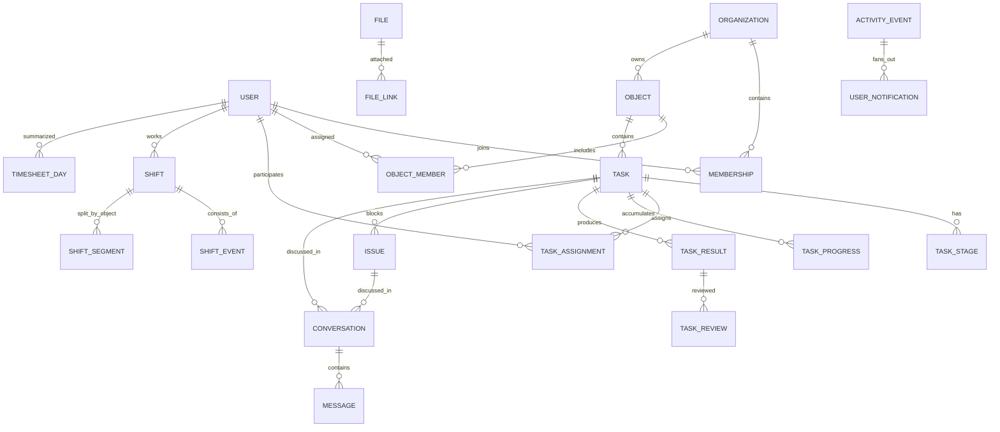

# Модель данных

Версия: 1.0  
Статус: концептуальная модель, ожидает технического ревью

## 1. Цель

Модель данных должна поддерживать:

- несколько подрядчиков и изоляцию их данных;
- объекты без обязательного бригадира;
- прямое взаимодействие подрядчика с рабочим;
- гибкие задачи без обязательных таймеров;
- подробный и проверяемый табель;
- офлайн-операции без дублей;
- историю всех значимых изменений;
- последующее развитие в мобильное приложение.

Это логическая модель. Конкретные SQL-поля и индексы уточняются на этапе проектирования API и миграций.

## 2. Общие соглашения

### 2.1. Идентификаторы

Основные сущности используют UUID. Клиент может заранее создать UUID офлайн и безопасно синхронизировать запись позже.

### 2.2. Мультитенантность

Каждая бизнес-сущность, принадлежащая подрядчику, содержит `organization_id`. Объектные сущности дополнительно содержат `object_id`, если это применимо.

Запрос никогда не полагается только на переданный клиентом идентификатор: сервер проверяет членство и область доступа.

### 2.3. Время

- в базе время хранится в UTC;
- у объекта сохраняется часовой пояс;
- для офлайн-событий различаются `occurred_at_device` и `received_at_server`;
- при необходимости сохраняется смещение часового пояса устройства;
- отчёты строятся в часовом поясе объекта или выбранной организации.

### 2.4. Версии и удаление

- изменяемые общие сущности содержат `version`;
- значимые изменения порождают доменное событие и запись аудита;
- бизнес-данные по умолчанию архивируются или мягко удаляются;
- физическое удаление применяется только по отдельной политике хранения.

### 2.5. Числа объёма

Объёмы хранятся как decimal, а не float. Единица измерения хранится отдельно и не меняется незаметно после появления результатов.

## 3. Пользователи и доступ

### 3.1. `users`

- `id`;
- ФИО отдельными полями;
- отображаемое имя;
- номер телефона в нормализованном виде;
- аватар;
- основная специализация;
- статус: активен, заблокирован, архивирован;
- дата создания и последней активности.

Профиль пользователя не определяет его полномочия во всех организациях.

### 3.2. `organizations`

- `id`;
- название;
- владелец;
- часовой пояс по умолчанию;
- настройки;
- статус подписки в будущем.

### 3.3. `organization_memberships`

Связывает пользователя и организацию:

- `organization_id`;
- `user_id`;
- роль: contractor, foreman, worker;
- статус членства;
- дата вступления;
- кто добавил;
- дополнительные разрешения при необходимости.

Один пользователь может иметь разные роли в разных организациях. Комбинации ролей внутри одной организации оформляются явно, а не скрытым флагом.

### 3.4. `object_members`

Определяет доступ к объекту:

- объект;
- пользователь;
- локальная роль;
- команда;
- дата начала и окончания назначения;
- статус.

### 3.5. `specializations`

Справочник специализаций организации: сварщик, слесарь, разнорабочий, монтажник, отделочник и другие. Подрядчик может дополнять справочник, не создавая дубликаты с разным регистром.

### 3.6. `invitations`

- организация;
- объект или список разрешённых объектов;
- предполагаемая роль;
- команда по желанию;
- хэш одноразового токена;
- срок действия;
- создатель;
- статус: active, used, revoked, expired;
- пользователь, который использовал ссылку.

Сам токен не хранится в открытом виде.

### 3.7. Аутентификация

Отдельные сущности:

- `password_credentials` — хэш пароля и версия алгоритма;
- `sessions` — серверные сессии и отзыв;
- `trusted_devices` — понятный список устройств;
- `passkey_credentials` — WebAuthn/passkey;
- `password_reset_requests` — одноразовые управляемые сбросы;
- `security_events` — входы, неудачные попытки, отзыв и смена пароля.

PIN приложения не хранится на сервере как пароль пользователя.

## 4. Объекты и структура работ

### 4.1. `objects`

- организация;
- название и код;
- адрес и координаты точки объекта по желанию;
- часовой пояс;
- статус: подготовка, активен, приостановлен, завершён, архив;
- даты работ;
- график по умолчанию;
- правила обеда;
- настройки отметок и задач.

### 4.2. `object_visuals`

- аватар;
- тип фона: photo, color, gradient, pattern;
- ссылка на фото;
- цвета;
- идентификатор системного узора;
- параметры контрастности текста;
- версия оформления.

### 4.3. `object_zones`

Один уровень или простая иерархия зон: корпус, этаж, секция, помещение. На MVP глубина ограничивается, чтобы интерфейс не превращался в BIM-систему.

### 4.4. `teams` и `team_members`

Команда — удобная группа работников, а не обязательный элемент задачи. Членство может иметь период действия и руководителя, но задача всё равно назначается напрямую людям или команде.

## 5. Графики и смены

### 5.1. `work_schedules`

- тип: фиксированный, индивидуальный, свободный;
- дни недели;
- плановое начало и окончание;
- допустимое окно;
- режим обеда: фиксированный или ручной;
- длительность/интервал обеда;
- правила опоздания и переработки.

### 5.2. `schedule_assignments`

Связывает график с организацией, объектом, командой или отдельным сотрудником и содержит период действия. Более конкретное назначение имеет приоритет.

### 5.3. `shifts`

Проекция текущего состояния смены:

- пользователь;
- организация;
- рабочая дата;
- статус;
- первое начало и итоговое окончание;
- рассчитанные перерывы;
- рабочие минуты;
- источник отметки;
- признаки аномалий;
- версия.

`shifts` удобна для быстрого интерфейса, но первичным доказательством остаются события.

### 5.4. `shift_events`

Неизменяемые события:

- shift_started;
- break_started;
- break_ended;
- object_changed;
- shift_ended;
- manager_marked;
- qr_scanned в будущем;
- correction_applied.

Поля:

- пользователь и смена;
- тип;
- время устройства и сервера;
- объект и зона;
- источник;
- идентификатор клиентской операции;
- доступные контрольные признаки;
- автор, если действие сделал руководитель.

### 5.5. `shift_segments`

Рассчитанные интервалы пребывания на конкретном объекте. Используются для перевода между объектами без создания параллельных смен.

### 5.6. `timesheet_correction_requests`

- смена или день;
- инициатор;
- требуемое изменение;
- причина;
- статус;
- рассматривающий;
- решение и комментарий.

### 5.7. `timesheet_corrections`

Принятое изменение:

- старое значение;
- новое значение;
- причина;
- ссылка на запрос;
- автор и согласовавший;
- время.

### 5.8. `timesheet_days`

Материализованная дневная проекция:

- плановые и фактические минуты;
- обед;
- опоздание и переработка;
- статус проверки;
- аномалии;
- версия расчёта.

### 5.9. `timesheet_periods` и `timesheet_versions`

Период закрывается конкретной версией. Последующие изменения создают новую версию с причиной, а не меняют уже выгруженный отчёт молча.

## 6. Задачи

### 6.1. `tasks`

Основные поля:

- организация, объект и зона;
- заголовок и описание;
- тип результата: checklist, quantity, composite;
- общий плановый объём и единица;
- приоритет;
- плановая дата или диапазон дней без обязательного времени начала/окончания;
- статус;
- создатель и назначивший;
- ответственный, если выбран;
- проверяющий;
- правила проверки;
- правила фото;
- версия;
- родительский шаблон по желанию.

### 6.2. `task_stages`

Один уровень этапов:

- задача;
- название и описание;
- порядок;
- тип результата;
- плановый объём и единица;
- обязательность;
- статус.

Этап не может иметь собственные дочерние этапы в MVP.

### 6.3. `task_assignments`

- задача;
- пользователь или команда;
- роль участия: assignee, responsible, reviewer, observer;
- период;
- кто назначил;
- статус.

Развёрнутое членство команды фиксируется на дату участия, чтобы исторический отчёт не менялся после изменения состава команды.

### 6.4. `task_daily_plans`

- задача;
- дата;
- план на день;
- остаток на начало дня;
- приоритет дня;
- комментарий планирования.

Дневной план не создаёт расписание «с 08:00 до 12:00».

### 6.5. `task_progress_entries`

Неизменяемые добавления прогресса:

- задача и этап;
- автор;
- значение и единица;
- командный или индивидуальный характер;
- время устройства и сервера;
- комментарий;
- источник;
- клиентская операция.

Исправление создаётся компенсирующей записью или новой версией с причиной, а не незаметным редактированием числа.

### 6.6. `task_results`

Отправленная версия результата:

- задача;
- версия;
- автор и ответственный;
- рабочая дата;
- итоговое значение;
- состояние этапов;
- комментарий;
- статус: draft, submitted, accepted, partially_accepted, rework, rejected;
- время отправки.

### 6.7. `task_reviews`

- результат;
- проверяющий;
- решение;
- подтверждённое значение;
- комментарий;
- время.

Заявленный и подтверждённый результат хранятся раздельно.

### 6.8. `task_events`

История постановки и изменений:

- создана;
- изменены поля;
- назначены или удалены участники;
- взята или передана ответственность;
- добавлен прогресс;
- отправлен результат;
- проведена проверка;
- задача перенесена, отменена или открыта заново.

## 7. Проблемы и решения

### 7.1. `issues`

- организация, объект, задача и этап;
- автор;
- категория;
- влияние: предупреждает, замедляет, блокирует;
- заголовок и описание;
- ответственный;
- статус: open, acknowledged, in_progress, resolved, closed;
- срок реакции по желанию;
- решение;
- версия.

### 7.2. `issue_events`

Фиксирует создание, подтверждение получения, смену ответственного, ответы, решение, повторное открытие и закрытие.

## 8. Коммуникации

### 8.1. `conversations`

Контекстная беседа может относиться к задаче, проблеме, объекту или прямому диалогу. Открытые неструктурированные групповые чаты не являются основой MVP.

### 8.2. `conversation_participants`

Определяет участников, область видимости, дату подключения и последний прочитанный элемент.

### 8.3. `messages`

- беседа и автор;
- текст;
- тип;
- время устройства и сервера;
- ссылка на отвечаемое сообщение;
- статус редактирования/удаления;
- клиентская операция.

Сообщение не изменяет поля задачи само по себе.

### 8.4. `mentions` и `message_receipts`

Отдельно хранят упоминания, доставку внутри системы, прочтение и явное ознакомление с важной инструкцией.

### 8.5. `announcements`

Объявления объекту или выбранной группе с автором, периодом показа и необязательным подтверждением ознакомления.

## 9. Файлы

### 9.1. `files`

- организация;
- владелец;
- ключ приватного объекта в хранилище;
- исходное имя и MIME;
- размер;
- контрольная сумма;
- состояние загрузки/обработки;
- метаданные изображения;
- время создания.

### 9.2. `file_links`

Полиморфная связь файла с задачей, этапом, результатом, проблемой, сообщением, объектом или профилем. Доступ к файлу наследуется от контекста, но проверяется сервером.

### 9.3. `file_versions`

Для документов, которые действительно требуют версии. Фото результата обычно являются отдельными файлами, а не версиями одного изображения.

## 10. Уведомления

### 10.1. `activity_events`

Доменное событие, из которого формируются центр активности, аудит и уведомления.

### 10.2. `user_notifications`

- пользователь;
- событие;
- уровень важности;
- состояние прочтения;
- состояние требуемого действия;
- группировочный ключ;
- время устаревания.

### 10.3. `push_subscriptions`

Подписка конкретного устройства, её возможности, время последнего успеха и статус отзыва.

### 10.4. `notification_deliveries`

Попытки доставки, провайдер, результат, открытие и причина ошибки. Это технический журнал, а не доказательство прочтения.

## 11. Офлайн и синхронизация

### 11.1. `sync_operations`

Серверный журнал принятых клиентских команд:

- `operation_id`;
- пользователь, устройство и организация;
- тип операции;
- целевая сущность;
- ожидаемая версия;
- состояние обработки;
- результат или конфликт;
- время устройства и сервера.

Уникальность `device_id + operation_id` обеспечивает идемпотентность.

### 11.2. `sync_changes`

Упорядоченный поток изменений, доступных пользователю после курсора. Содержит только разрешённые записи и минимальный payload для локального обновления.

## 12. Аудит и фоновые задания

### 12.1. `audit_events`

Фиксирует:

- организацию;
- автора или системный источник;
- действие;
- сущность;
- старое и новое представление значимых полей;
- причину;
- IP/устройство в допустимом объёме;
- время.

### 12.2. `background_jobs`

Очередь для:

- обработки фото;
- экспорта Excel/PDF;
- рассылки push;
- пересчёта проекций;
- ежедневных сводок;
- очистки истёкших данных.

Повтор фонового задания должен быть безопасным.

## 13. Источники истины и проекции

| Область | Источник истины | Быстрая проекция |
|---|---|---|
| Смена | `shift_events` + корректировки | `shifts`, `timesheet_days` |
| Прогресс | `task_progress_entries` | агрегаты задачи и дня |
| Результат | версии `task_results` и `task_reviews` | текущий статус задачи |
| Коммуникация | `messages` | счётчики непрочитанного |
| Активность | доменные события | `user_notifications` |
| Закрытый период | `timesheet_versions` | экспорт и сводка версии |

Проекция может быть пересчитана из первичных записей. Это защищает табель и отчёты от труднообъяснимых расхождений.

## 14. Ключевые ограничения базы

- не более одной открытой смены на человека в организации;
- номер телефона уникален в нормализованном виде для входа;
- одно приглашение используется не более одного раза;
- задача содержит не более одного уровня этапов;
- единица уже используемого объёма не меняется без миграции/новой задачи;
- один текущий ответственный на задачу;
- принятие ответственности выполняется атомарно;
- одна клиентская операция не применяется дважды;
- закрытая версия табеля неизменяема;
- членство и доступ проверяются в рамках организации;
- файл без разрешённого контекста не выдаётся.

## 15. Высокоуровневая схема

## 16. Что сознательно не моделируется в MVP

- проводки и финансовые операции;
- зарплатные начисления;
- складские остатки и закупки;
- телематика техники;
- сложная сметная структура;
- BIM-модель;
- непрерывный GPS-трек;
- биометрическая идентификация лица;
- произвольные глубокие деревья задач.

